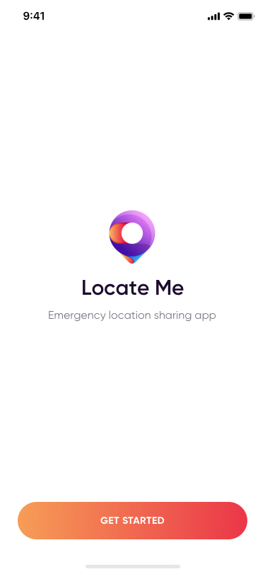
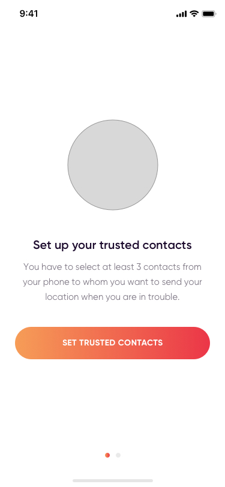
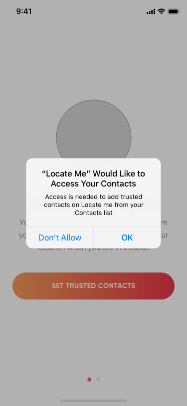
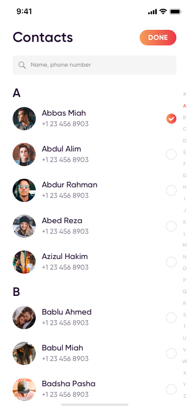
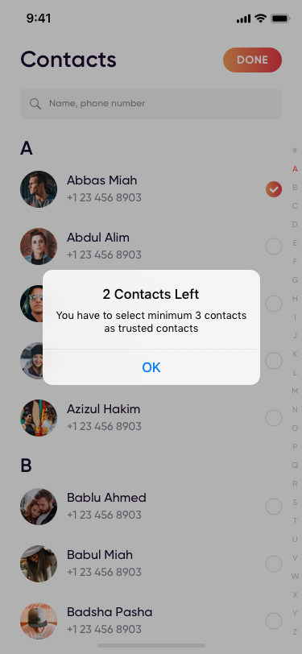
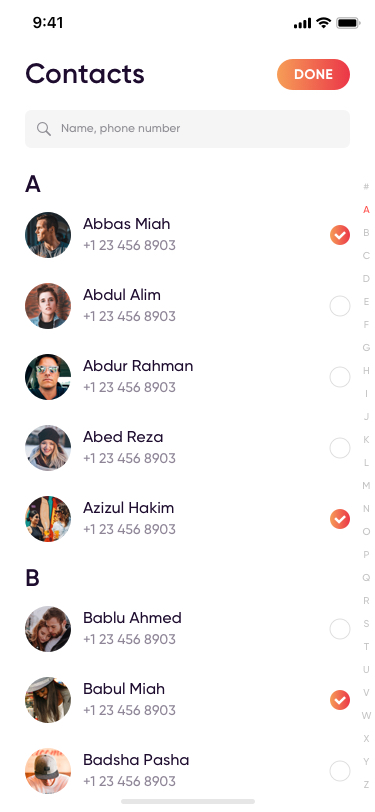
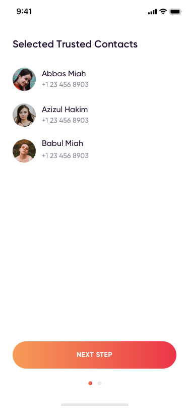
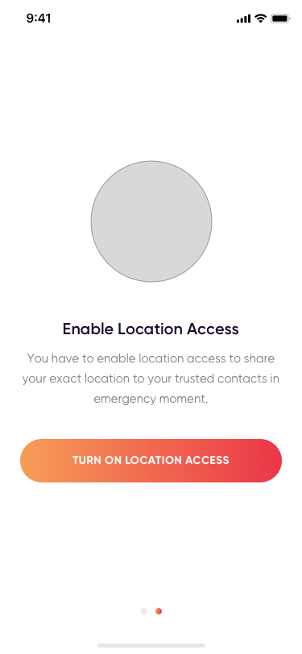
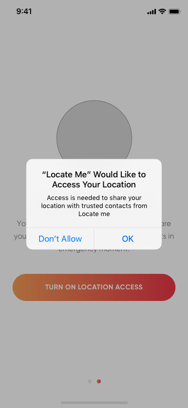
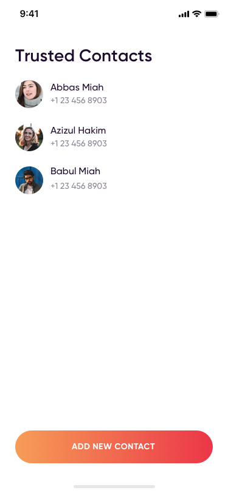

# Locate-Me
The “Locate Me” is a cross-platform mobile application built with Google’s new UI framework Flutter. The purpose of the application is to notify the emergency contact in an emergency situation with the least time and easy way.

    
    
    
    
    
    
    
    
    
    

